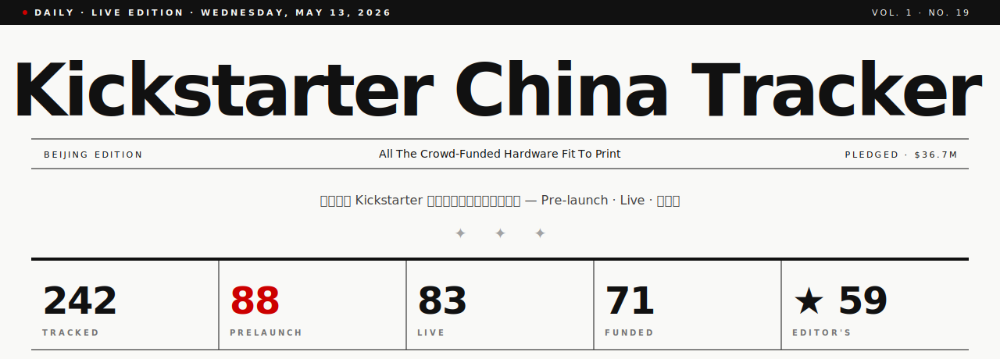
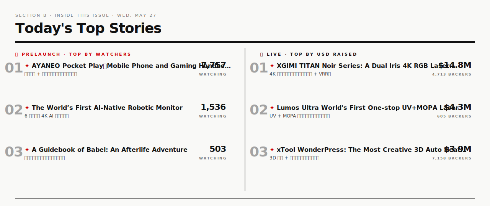

<p align="center">
  <strong><em>All The Crowd-Funded Hardware Fit To Print.</em></strong><br>
  一份每日发行的报纸 — Kickstarter 上中国背景消费硬件项目的每日追踪。<br>
  Printed every morning at 09:00 Beijing via GitHub Actions.
</p>

<p align="center">
  <a href="https://chen17-sq.github.io/kickstarter-china-tracker/"></a>
  <a href="https://chen17-sq.github.io/kickstarter-china-tracker/subscribe.html"></a>
  <a href="https://chen17-sq.github.io/kickstarter-china-tracker/editions/latest.html"></a>
  <a href="https://chen17-sq.github.io/kickstarter-china-tracker/editions/"></a>
  <a href="https://chen17-sq.github.io/kickstarter-china-tracker/editions/latest.pdf"></a>
  <a href="https://chen17-sq.github.io/kickstarter-china-tracker/social/"></a>
</p>



---

<details>
<summary><b>Inside this issue · 怎么读这份报纸</b></summary>

<br>

| Section | What it shows |
| :--- | :--- |
| **完整看板** ([Pages](https://chen17-sq.github.io/kickstarter-china-tracker/)) | 140+ 项可筛选 / 排序的项目大表 + 今日头版 hero |
| **今日头版 · 视觉版** ([editions/latest.html](https://chen17-sq.github.io/kickstarter-china-tracker/editions/latest.html)) | 完整 Newsprint 视觉，跟订阅邮件**像素级一致**——可分享 |
| **过往日报存档** ([editions/](https://chen17-sq.github.io/kickstarter-china-tracker/editions/)) | 永久存档每天发出去的报纸，按日期浏览 |
| **今日头版 · Markdown** (`reports/latest.md`) | KPI · Top Movers · Top Prelaunch · Top Live · Funded（GitHub markdown 灰色） |
| **JSON 数据** (`data/projects.json`) | 完整结构化数据，可被任意第三方仪表盘消费 |
| **历史快照** (`data/history/`) | 每日 cron 一份时间戳快照，用于算 Δ |
| **品牌库** (`brands/china_brands.yaml`) | 可 PR 维护的品牌白名单 |
| **中文一句话** (`data/blurbs_zh.json`) | 100+ 人工翻译 + LLM 自动补齐 |

</details>

<details>
<summary><b>How it works · 流水线</b></summary>

<br>

1. **`scraper/discover.py`** — `curl_cffi` + Chrome/Safari TLS 指纹绕 Cloudflare，访问 `kickstarter.com/discover/advanced?...&format=json`
2. **`scraper/classify.py`** — 三层规则判定中国背景：（a）品牌白名单（覆盖在美国注册 KS 账号但实际中国团队的品牌）；（b）KS location 字段；（c）人工标注的 medium-confidence
3. **`scraper/project.py`** — KS GraphQL `/graph` 端点拉 `watchesCount`（pre-launch follower 数）
4. **`scraper/translate.py`** — 用 Claude Haiku 4.5 自动补齐缺的中文一句话（人工版本永不被覆盖）
5. **`scraper/momentum.py`** — 对比上一份 history 快照，算 Δ followers / Δ backers / Δ pledged_usd
6. **`scraper/banner.py`** — 生成三张 SVG（masthead / today's snapshot / OG card），全部按 Newsprint 设计每日刷新
7. **`scraper/email_notify.py`** — 通过 Resend 发 HTML 邮件到订阅者
8. **`scraper/report.py`** — Markdown 日报落到 `reports/YYYY-MM-DD.md` 和 `reports/latest.md`
9. **`scraper/run.py`** — 串以上 + 安全闸（中国分类结果 < 20 项即拒绝覆盖 `projects.json`）
10. **`.github/workflows/scrape.yml`** — `cron 0 1 * * *` 每天触发；commit `data/`、`reports/`、`assets/`

</details>

<details>
<summary><b>Setup · 部署你自己的</b></summary>

<br>

```bash
git clone https://github.com/Chen17-sq/kickstarter-china-tracker.git
cd kickstarter-china-tracker
pip install -r requirements.txt
python -m scraper.run
```

Fork 后启用：
1. **Settings → Actions → General**：勾上 *Read and write permissions*
2. **Settings → Pages**：Source 选 *GitHub Actions*
3. **Settings → Secrets**（可选）：
   - `RESEND_API_KEY` + `NOTIFY_EMAIL_TO` — 启用每日邮件
   - `ANTHROPIC_API_KEY` — 启用中文一句话自动翻译

</details>

<details>
<summary><b>Limitations · 已知限制</b></summary>

<br>

- **Cloudflare 概率挡爬**：`scraper/http.py` 4 次 retry + TLS 指纹轮换（safari17_0 / chrome131 / chrome120 / edge101），命中率 > 95%
- **品牌库覆盖率**：当前 142 项目里 ~36 项命中品牌白名单，~106 项靠 KS location 字段判定。前者识别更精确
- **Followers 字段**：从 KS GraphQL `watchesCount` 读取。对 *prelaunch* 是当前实时关注；对 *live* / *已结束* 是上线时冻结的预热基线（仍可看转化率）

</details>

---

<p align="center">
  <sub>Code: <a href="LICENSE">MIT</a> · Data: belongs to <a href="https://www.kickstarter.com">Kickstarter</a> · Architecture: <a href="ARCHITECTURE.md">notes</a> · Contributing: <a href="CONTRIBUTING.md">guide</a></sub>
</p>
